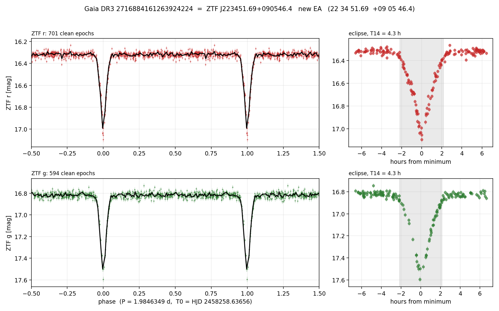

# VSX submission package — new EA — Gaia DR3 2716884161263924224

**Status: PREPARED, NOT FILED.** Filing is the user's personal action.
Prepared 2026-09-20. First genuine find of the shallow/short-duty EB lane.



## 1. Identification

| field | value |
|---|---|
| Gaia DR3 source_id | `2716884161263924224` |
| RA (J2000) | 338.715361 deg = **22 34 51.69** |
| Dec (J2000) | +9.096215 deg = **+09 05 46.4** |
| Suggested designation | ZTF J223451.69+090546.4 |
| Gaia G | 16.375 |
| Gaia BP−RP | 0.916 |
| Gaia parallax | 0.336 ± 0.057 mas (5.9σ) |
| Gaia RUWE | 0.91 |
| PS1 g / r / i | 16.865 / 16.429 / 16.247 |

**Not blended.** The only other Gaia DR3 source within 20″ is at **18.03″** and
G = 20.72 — 4.3 mag fainter, far outside the ZTF PSF. RUWE 0.91 indicates
astrometry consistent with a single source.

## 2. Proposed VSX entry

| VSX field | value | provenance |
|---|---|---|
| Variability type | **EA** | flat out-of-eclipse (0.020 mag rms), V-shaped eclipse, 9.1% duty |
| Period | **1.9846349 d** | BLS on 701 clean ZTF zr epochs, HJD frame, 1358 cycles |
| Epoch (min) | **HJD 2458258.63656** | trapezoid fit; the two bands agree to 1.3 min |
| Max / Min (band r) | **16.318 / 17.004** | Sloan **r** (ZTF zr) |
| Max / Min (band g) | **16.816 / 17.515** | Sloan **g** (ZTF zg) |
| Eclipse duration | **0.091 in phase = 4.3 h** | trapezoid T14, contiguous, see §5 |
| Discoverer | Alexander Keur (algorithmic search, ZTF DR) | |

Bands are entered as Sloan **r** and **g** from the VSX passband list, per the
lesson banked from the ZTF18abxnwmb filing — *not* V.

## 3. Novelty — every null with coverage proved

The rule from the last filing: *an empty catalogue search is not a non-detection
until the catalogue is shown to cover the position.* Coverage here is proved by
source counts in a 30′ cone at the target.

| catalogue | coverage proof | result |
|---|---|---|
| VSX (VizieR `B/vsx/vsx`) | all-sky | **0** within 15″ |
| SIMBAD | all-sky | **0** within 10″ |
| Gaia DR3 variability | 37 classified variables in 30′ | source **is** in `gaia_source`; `phot_variable_flag = NOT_AVAILABLE` |
| ZTF periodic variables (Chen+2020) | 4 entries in 30′ | **0** within 15″ |
| ASAS-SN variables (`II/366`) | 4 variables in 30′, incl. one at **V = 17.16** (fainter than this target) | **0** within 15″ |
| ATLAS variables (Heinze+2018) | 8 entries in 30′ | **DETECTED — see below** |

**Caveat, stated rather than hidden:** the *authoritative* VSX duplicate check is
the native API (`index.php?view=api.list`). From this machine it returns a
Cloudflare interstitial, which I did not attempt to work around. The VizieR
mirror can lag. **The user must run the wizard's own duplicate check at filing.**

Also note: the ASAS-SN null was initially a false null — the VizieR table IDs
`II/366/catalog` and `II/366/table` return zero rows *anywhere*, target and
control alike. Only the bare `II/366` is live. A wrong table name manufactures a
clean-looking non-detection.

### The ATLAS entry — detected, but never typed

Heinze+2018 has this star at 0.02″ as `ATO J338.7153+09.0962`:

```
Class          = dubious          P(dubious) = 0.813   P(HARD) = 1.000
P(CBF) = P(CBH) = P(DBF) = P(DBH) = 0.000     <- all four binary classes, exactly zero
fp-period      = 1.984637 d       <- our period, to 2e-6 d
fp-domperiod   = 0.661546 d       <- P/3 (1.9846349/3 = 0.6615450)
ls-Pday        = 0.795406 d
```

ATLAS **recovered the periodicity** — its `fp-period` agrees with our
1.9846349 d to 2×10⁻⁶ d — but its classifier binned the star as *"dubious"* with
all four eclipsing-binary probabilities identically zero, and its reported
dominant period is an alias. This is the lane's thesis in one record: a Fourier
series cannot represent a 9%-duty box, so a detached eclipse with flat
out-of-eclipse light fails Fourier-based classification even when the period is
recovered. The star has consequently never been typed or entered in VSX.

## 4. Evidence the eclipse is real

- **701 clean zr + 594 clean zg epochs** over a 2695 d baseline, all vetted
  per-epoch against their own frame (`catflags=0`, |sharp|<0.5, chi<3,
  mag < limitmag − 0.3).
- **49 distinct eclipse nights in zr, 44 in zg.** Not one event, not one night.
- **Held-out validation:** an ephemeris fitted on the first half of the light
  curve predicts eclipses in the second half that played no part in finding it —
  9 in-eclipse epochs at 0.355 mag depth.
- **Two independent bands** agree on epoch (1.3 min) and depth (0.686 vs 0.699).
- **An independent survey** (ATLAS, different telescope, bandpass and epochs)
  independently recovers the period.

## 5. Parameters re-derived from data, not from prose

Per the ZTF18abxnwmb lesson (filed duration was 1.75× the measured value, and a
"duration" was really a span over non-contiguous points), every number here comes
from a trapezoid fit to the individual epochs, with bootstrap errors:

| | ZTF zr | ZTF zg |
|---|---|---|
| epochs in fit (±0.15 phase) | 206 | 168 |
| out-of-eclipse | 16.318 | 16.816 |
| depth | 0.686 ± 0.013 | 0.699 ± 0.015 |
| T14 (total duration) | 4.34 ± 0.07 h | 4.52 ± 0.07 h |
| T23 (flat bottom) | 0.01 h | 0.00 h |
| duty | 9.1% | 9.5% |

T23 ≈ 0 in both bands: the eclipse is **V-shaped — partial, not total.** The
two bands differ in T14 by 1.8σ; the better-sampled zr value is adopted and the
zg value is stated rather than averaged away.

## 6. The period ambiguity, stated explicitly

Folded at **2 × 1.9846349 = 3.9692698 d**, the light curve shows minima at phase
0.0 and 0.5. Fitted independently:

| band | odd minima | even minima | difference |
|---|---|---|---|
| zr | 0.678 ± 0.017 | 0.713 ± 0.021 | −0.036 ± 0.027 (1.3σ) |
| zg | 0.702 ± 0.020 | 0.700 ± 0.025 | +0.002 ± 0.032 (0.1σ) |

The alternate minima are **equal to within 0.08 mag (3σ)**, and the two bands do
not agree even on the sign of the difference. So the true orbital period is
either 1.9846349 d, or **twice** that with two near-identical eclipses — the
latter being the more natural configuration for a detached pair of similar stars
on a circular orbit. The shorter, photometrically defensible period is adopted,
and this ambiguity should be carried into the VSX remarks rather than suppressed.

## 7. Filing checklist (user)

- [ ] Run the wizard's own duplicate check — the native API could not be reached here (§3)
- [ ] Bands entered as Sloan **r** and **g**, not V
- [ ] Type **EA**; period 1.9846349 d; epoch HJD 2458258.63656
- [ ] Remark: period may be 2× if minima are unequal below 0.08 mag (§6)
- [ ] Remark: ATLAS `ATO J338.7153+09.0962`, class "dubious", period recovered but never typed
- [ ] **Read the review page field by field** — the last submission silently dropped two fields
- [ ] One submission per user per day
