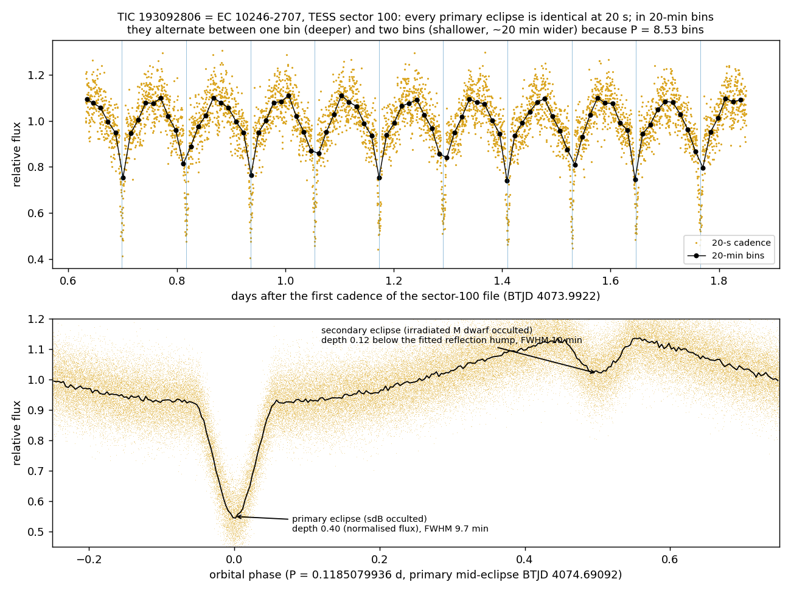

# EC 10246-2707 — pipeline crosscheck (2026-09-23)

**Object.** EC 10246-2707 = TIC 193092806 = Gaia DR3 5468670738602933504 (RA 156.73529, Dec −27.38255).
Eclipsing sdB + dM binary (HW Vir type), P = 0.1185079936 d (VSX); Barlow et al. 2013 (2013MNRAS.430...22B).
Raised in the Planet Hunters TESS Talk thread "What is this star?" (Strange Stars board, subject 119913138, May 2026).

## Gaia DR3

G 14.44, BP−RP −0.33, parallax 1.018 ± 0.035 mas (M_G ≈ 4.48), RUWE 1.13, astrometric_excess_noise_sig 21.29,
phot_variable_flag VARIABLE.

## Our pipeline

| step | result |
|---|---|
| `quick_known.py` | known: VSX (P 0.1185079936 d), SIMBAD (hot subdwarf), 9 ADS papers incl. Barlow+2013, Kilkenny 2014, Pulley+2018 |
| hunt selection | not selected by any hunt: Track 1 needs parallax > 2 mas and M_G > 4.5; VarWISE below-main-sequence screen needs M_G > 7; not in the Arévalo reservoir, the eRASS:3 low-pany pool or the van Roestel eclipsing-WD catalogue |
| `wise_battery.py` (lane M) | 233 clean NEOWISE epochs; W1 periodogram peak 0.1185078 d. At the VSX period: W1 0.272 ± 0.030, W2 0.255 ± 0.079, ZTF g 0.226 ± 0.025, ZTF r 0.243 ± 0.017 mag (sinusoid amplitudes): no infrared excess. Photocentre bright vs faint and WISE proper motion consistent with the Gaia star |
| `mwcheck.py` | matches: GALEX AIS and GR5, VSX, Gaia DR3 variability, ATLAS variables, ASAS-SN variables, Gavras+2023, Ritter-Kolb pre-CV table (B/cb/pcbdata, 0.4″), Gentile Fusillo+2021 white dwarf catalogue. No radio, X-ray or gamma-ray match; no query holes |

## TESS

SPOC light curves exist for sectors 9, 36, 62, 63, 89, 99 and 100 (2-min) and 36, 62, 63, 89, 99 and 100 (20-s).
Sector 100 (`scripts/s100.py`, PDCSAP, QUALITY = 0):

- Primary eclipse (sdB occulted): mid-eclipse BTJD 4074.69092; depth 0.40 of the median flux; FWHM 9.7 min;
  first-to-last contact ≈ 22 min.
- Secondary eclipse at phase 0.5 (irradiated M dwarf occulted): depth 0.12 below the fitted reflection hump; FWHM 10.2 min.
- Reflection effect: 0.22 peak-to-peak outside eclipse.
- 20-min bins: P = 8.53 bins, so consecutive primary eclipses alternate between one bin (depth 0.27, half-depth width
  20 min) and two bins (depth ≈ 0.2, width 40 min). 10-min bins: P = 17.07 bins, the pattern drifts with a ~1.8 d beat.
  The 20-s data show identical eclipses throughout.
- Near day 1.16 after the first cadence of the file (BTJD 4073.9922) there are primary eclipses at days 1.054 and 1.173;
  unbinned residuals from the folded template there have rms 0.025 (whole sector 0.026).

Data: MAST SPOC products `tess2026033082000-s0100-0000000193092806-0302-{s_lc,a_fast-lc}.fits`, downloaded to
`/tmp/ec10246/mastDownload/TESS/` (the scripts read from there).
