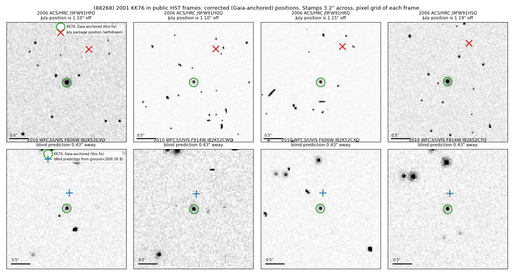

# (88268) 2001 KK76 — HST positions re-measured against Gaia DR3 (2026-09-22)

Draft. Nothing has been sent to the MPC.

## Summary

- 12 public HST frames: 4 × ACS/HRC CLEAR, 2006-05-02 (GO-10514); 4 × WFC3/UVIS (F606W, F814W) and
  4 × WFC3/IR (F139M, F153M), 2010-03-13 (GO-11644).
- Each frame is tied to Gaia DR3 stars in that frame (proper motions propagated to the epoch): 5–6 stars
  per HRC frame, 9–11 per UVIS frame, about 475 per IR frame.
- KK76 is measured in all 12 frames. The 2006 positions differ from the July package by 1.10–1.19″.
- An independent re-measurement of the same frames agrees to 0.008–0.021″.
- All 53 observations (41 ground-based, 12 HST) fit one orbit; HST residuals ≤ 0.031″.

## Measurements (`kk76_positions_gaia_anchored.csv`)

Target centroids from an elliptical-Gaussian fit with outlier clipping; frame tie = shift in the tangent
plane (an affine tie moves the target by ≤ 0.04″ in 2006 and ≤ 0.003″ in 2010). obsTime =
(EXPSTART+EXPEND)/2, UTC. HST geocentric vectors from JPL Horizons (body −48).

| frame | Gaia − header WCS (″) | stars | difference from independent re-measurement (″) | fit C residual (″) |
|---|---|---|---|---|
| J9FW91HPQ (2006 HRC) | (−0.877, −0.676) | 6 | (+0.009, +0.010) | (+0.006, −0.010) |
| J9FW91HQQ | (−0.872, −0.675) | 6 | (+0.011, +0.008) | (−0.004, −0.012) |
| J9FW91HRQ | (−0.941, −0.671) | 6 | (+0.008, +0.003) | (−0.006, −0.013) |
| J9FW91HSQ | (−1.006, −0.652) | 5 | (+0.012, +0.017) | (+0.004, −0.001) |
| IB2K52CVQ (2010 UVIS F606W) | (+0.087, +0.087) | 9 | (+0.003, +0.013) | (−0.007, −0.005) |
| IB2K52CWQ (F814W) | (+0.044, +0.140) | 9 | (+0.002, +0.015) | (−0.008, +0.000) |
| IB2K52CXQ (F606W) | (+0.489, +0.117) | 11 | (+0.002, +0.009) | (−0.009, +0.006) |
| IB2K52CYQ (F814W) | (+0.460, +0.096) | 11 | (+0.003, +0.009) | (+0.004, +0.004) |
| IB2K52CZQ (IR F139M) | (+0.412, +0.171) | 477 | (+0.009, +0.012) | (+0.006, +0.016) |
| IB2K52D0Q (IR F153M) | (+0.292, +0.162) | 478 | (+0.010, +0.008) | (+0.019, +0.025) |
| IB2K52D2Q (IR F139M) | (+0.176, +0.173) | 473 | (+0.010, +0.005) | (+0.006, −0.007) |
| IB2K52D3Q (IR F153M) | (+0.071, +0.251) | 475 | (+0.008, +0.005) | (+0.007, +0.001) |

In the 2010 frames KK76 lies (−0.38, +0.20)″ from the position predicted by fit B (ground + 2006); the
offset is constant over the 4 UVIS frames (scatter 0.005″) and the 4 IR frames (0.02″).

## Orbit fits (find_orb; HST sigmas 0.03″ HRC/UVIS and 0.04″ IR; ground observations at find_orb defaults; no JPL DE)

| fit | data | result |
|---|---|---|
| D | 41 ground | predicts the 2006 positions within (+0.05, +0.17)″ |
| B | ground + 4 × 2006 | HST residuals ≤ 0.007″; predicts the 2010 positions within 0.43″ |
| E | ground + 8 × 2010 | predicts the 2006 positions within (−0.08, +0.02)″ |
| C | all 53 | HST residuals ≤ 0.031″; ground rms 0.18″ / 0.27″ |

Geocentric position differences from fit C (dRA·cosδ, dDec, arcsec):

| orbit | 2026-09-22 | 2030-01-01 | 2040-01-01 |
|---|---|---|---|
| Horizons-based fit to the same data | (+1.65, −0.16) | (+1.73, −0.13) | (+2.04, −0.04) |
| fit D, ground only | (+6.49, +0.93) | (+8.99, +1.47) | (+17.92, +4.09) |
| July joint orbit | (+41.23, +5.45) | (+53.92, +8.67) | (+98.35, +22.99) |
| JPL SBDB orbit | (+57.85, +4.87) | (+75.43, +9.11) | (+136.97, +28.09) |

Fit C geocentric 2026-09-22 00:00 UTC: RA 280.990569°, Dec −23.529654°.
Fit C and the Horizons-based fit differ in osculating elements (a 42.578 vs 42.714 AU; e 0.0196 vs
0.0183; ω 229.9° vs 214.5°) and agree on predicted positions to 2″ through 2040.

## Superseded

- July package (2026-07-08): the four 2006 positions, the refit values and the ADES draft (`../kk76_refit/`).
- 2010 non-detection records (July; `../kk76_2010_recheck/`).
- HRC CLEAR magnitudes 24.3–24.5.

## Filing status

`ades_draft_v2_88268_2001kk76.psv`: 12 rows, astCat Gaia3, rms 0.03″ (0.04″ IR), HST geocentric vectors,
no photometry. Draft; SARC contact by the user.

Scripts: `scripts/` (run from `/tmp/kk76_fix`). Fits: `fits/`.
