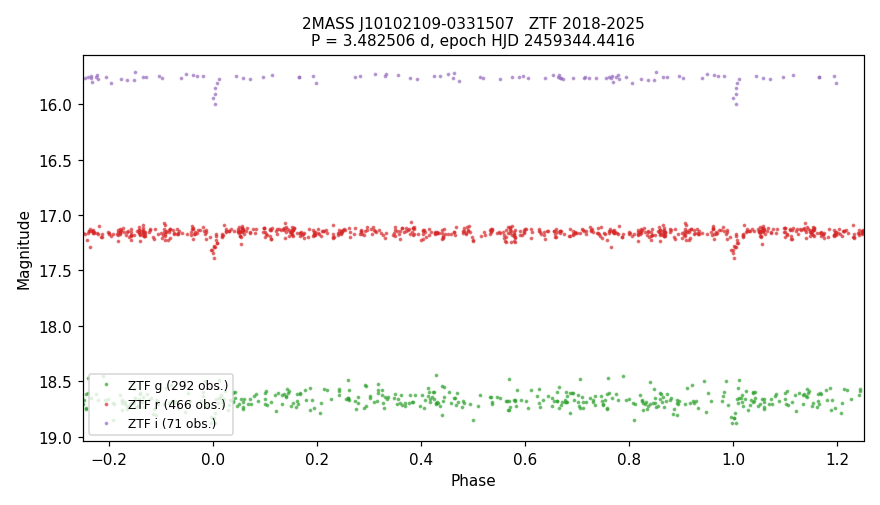

# VSX submission package — 2MASS J10102109-0331507

Status: prepared, not submitted.

## Values to submit

| field | value |
|---|---|
| Position (J2000) | 10 10 21.10 -03 31 50.7 (Gaia DR3, epoch 2000.0) |
| Primary name | 2MASS J10102109-0331507 |
| Other names | Gaia DR3 3828306424841718656; TIC 77559751; ZTF20acifrhn; WISEA J101021.09-033150.8 |
| Constellation | Sextans |
| Type | EA |
| Spectral type | not given |
| Magnitude range | 17.15 – 17.34 r |
| Period | 3.482506 d |
| Epoch | HJD 2459344.4416 |
| Eclipse duration | 2.3% (1.9 h) |
| Discoverer | A. Keur |
| Reference | Bellm, E. C.; et al., 2019, The Zwicky Transient Facility: System Overview, Performance, and First Results — 2019PASP..131a8002B |
| File | `2MASS_J10102109-0331507_ZTF_phase.png` ("ZTF phase plot") |

## Remarks (to submit)

ZTF light curves from 2018 to 2025 in g, r and i show eclipses 0.19 mag deep in r, lasting about 1.9 hours.
A shallow secondary eclipse, about 0.06 mag in r, may be present at phase 0.50 but is not certain. If both
stars are alike, the orbital period is twice the value given (6.965012 d). Period and epoch are from the
ZTF data. The star is an M dwarf at about 270 pc (Gaia DR3 parallax 3.71 mas). Position from Gaia DR3,
moved to epoch J2000.0.

## Measurements

- Out-of-eclipse: r 17.15, g 18.67.
- Primary depth: r 0.19 ± 0.03, g 0.17 ± 0.03 mag. Possible secondary at phase 0.50: r 0.057 ± 0.019 mag
  (7 points in the window), g 0.11 ± 0.06 (2 points).
- Period: the pipeline's 1.741262 d is half the eclipse spacing (alternate half-cycles are covered and flat).
  At 6.965012 d the two eclipses have equal depth within errors (r 0.111 ± 0.023 vs 0.129 ± 0.048).
- Epoch uncertainty ± 0.0028 d. Data: 292 g, 466 r, 71 i epochs, HJD 2458202.8 – 2460970.0.
- Gaia DR3: G = 16.72, BP−RP = 2.73, parallax 3.712 ± 0.116 mas (269 pc), M_G = 9.57, Teff (GSP-Phot)
  3430 K, RUWE 1.41.

## Catalogue checks (2026-09-22)

- VSX live API: nothing within 1′ (9 entries within 20′). VSX VizieR mirror: absent, coverage proved.
- Absent, with coverage proved: Chen+2020, Heinze+2018, Gaia DR3 variability classification and
  eclipsing-binary tables, Gavras+2023, ASAS-SN, Mowlavi+2021.
- Present in Maíz Apellániz+2023 (Gaia DR3 photometric dispersions): variability flag VVM, no type or period.
- All VizieR tables within 6″: 50. SCoPe: this star's ZTF fields are not among its 210 fields.
- SIMBAD, TNS: nothing. ADS full text: 0 hits for the Gaia DR2/DR3, 2MASS, WISEA, TIC, PS1 and ZTF names.
- Machine labels: ALeRCE ZTF20acifrhn (4 alert detections), stamp classifiers only; Lasair Sherlock "VS".
- eRASS1: no X-ray source within 30″. GALEX: no UV source within 8″.

## Data sources

ZTF (Bellm+2019, 2019PASP..131a8002B; Masci+2019, 2019PASP..131a8003M); Gaia DR3 (2023A&A...674A...1G);
Maíz Apellániz+2023 (2023A&A...677A.137M).
