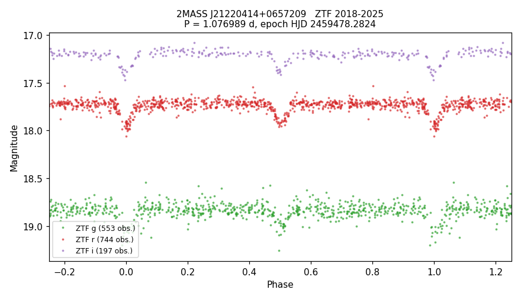

# VSX submission package — 2MASS J21220414+0657209

Status: prepared, not submitted.

## Values to submit

| field | value |
|---|---|
| Position (J2000) | 21 22 04.13 +06 57 20.8 (Gaia DR3, epoch 2000.0) |
| Primary name | 2MASS J21220414+0657209 |
| Other names | Gaia DR3 1738942132557316864; TIC 288399140; ZTF19abbxuzo; WISEA J212204.14+065720.8; SDSS J212204.13+065720.7 |
| Constellation | Equuleus |
| Type | EA |
| Spectral type | not given |
| Magnitude range | 17.72 – 17.95 r; secondary minimum 17.92 r |
| Period | 1.076989 d |
| Epoch | HJD 2459478.2824 |
| Eclipse duration | 7.1% (1.8 h) |
| Discoverer | A. Keur |
| Reference | Bellm, E. C.; et al., 2019, The Zwicky Transient Facility: System Overview, Performance, and First Results — 2019PASP..131a8002B |
| File | `2MASS_J21220414+0657209_ZTF_phase.png` ("ZTF phase plot") |

## Remarks (to submit)

ZTF light curves from 2018 to 2025 in g, r and i show two eclipses per cycle, 0.23 mag and 0.20 mag deep
in r, with the secondary at phase 0.50. The eclipses last about 1.8 hours. Period and epoch are from the ZTF
data. Gaia DR2 photometry flagged the star as having a large amplitude, without a type. A 2026 ZTF
classification catalogue lists it as non-variable. Position from Gaia DR3, moved to epoch J2000.0.

## Measurements

- Out-of-eclipse: r 17.72, g 18.83.
- Primary depth: r 0.228, g 0.235 mag (trapezoid fit; bootstrap ± 0.010 / 0.03). Secondary (phase 0.50):
  r 0.200 ± 0.007, g 0.172 ± 0.016 mag.
- Eclipse duration 7.1 ± 0.6% of the period in r (1.83 h), 7.2 ± 1.2% in g.
- Epoch uncertainty ± 0.0010 d. Data: 553 g, 744 r, 197 i epochs, HJD 2458247.0 – 2460969.8.
- Gaia DR3: G = 17.87, BP−RP = 1.63, parallax 0.729 ± 0.157 mas, Teff (GSP-Phot) 4010 K, RUWE 1.26.

## Catalogue checks (2026-09-22)

- VSX live API: nothing within 1′ (28 entries within 20′). VSX VizieR mirror: absent, coverage proved.
- Absent, with coverage proved: Chen+2020, Heinze+2018, Gaia DR3 variability classification and
  eclipsing-binary tables, Gavras+2023, ASAS-SN, Maíz Apellániz+2023.
- Present in Mowlavi+2021 (Gaia DR2 large-amplitude variables): AmpG 0.065, all class flags 0, no period.
- All VizieR tables within 6″: 48. SCoPe: this star's ZTF fields are not among its 210 fields.
- SIMBAD, TNS: nothing. ADS full text: 0 hits for the Gaia DR2/DR3, 2MASS, WISEA, TIC, SDSS, PS1 and ZTF names.
- Machine labels: ALeRCE ZTF19abbxuzo, light-curve classifiers "Periodic" / "Periodic-Other", ATAT
  forced-photometry (beta) EA 0.33; Lasair Sherlock "VS".
- MDW Hα DR1: no Hα excess relative to field stars of the same colour (−0.6σ).

## Data sources

ZTF (Bellm+2019, 2019PASP..131a8002B; Masci+2019, 2019PASP..131a8003M); Gaia DR3 (2023A&A...674A...1G);
Mowlavi+2021 (2021A&A...648A..44M).
