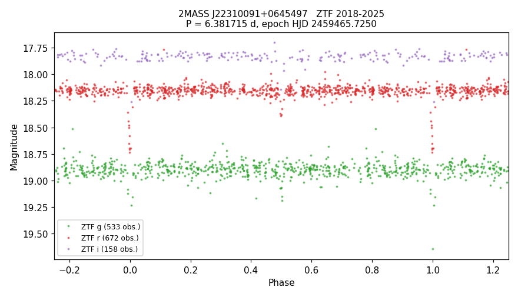

# VSX submission package — 2MASS J22310091+0645497

Status: prepared, not submitted.

## Values to submit

| field | value |
|---|---|
| Position (J2000) | 22 31 00.94 +06 45 49.8 (Gaia DR3, epoch 2000.0) |
| Primary name | 2MASS J22310091+0645497 |
| Other names | Gaia DR3 2709405317531811840; TIC 419880104; ZTF19abzvwvd; WISEA J223100.93+064549.4; SDSS J223100.93+064549.7 |
| Constellation | Pegasus |
| Type | EA |
| Spectral type | not given |
| Magnitude range | 18.15 – 18.68 r; secondary minimum 18.36 r |
| Period | 6.381715 d |
| Epoch | HJD 2459465.7250 |
| Eclipse duration | 2.3% (3.5 h) |
| Discoverer | A. Keur |
| Reference | Bellm, E. C.; et al., 2019, The Zwicky Transient Facility: System Overview, Performance, and First Results — 2019PASP..131a8002B |
| File | `2MASS_J22310091+0645497_ZTF_phase.png` ("ZTF phase plot") |

## Remarks (to submit)

ZTF light curves from 2018 to 2025 in g, r and i show a primary eclipse of 0.52 mag in r and a secondary
eclipse of 0.21 mag at phase 0.50. The eclipses last about 3.5 hours. Period and epoch are from the ZTF data.
The DESI DR1 spectrum is classified as a K-type star, with a radial velocity of -178 km/s from one epoch.
A 2026 ZTF classification catalogue lists the star as non-variable. Position from Gaia DR3, moved to
epoch J2000.0.

## Measurements

- Out-of-eclipse: r 18.15, g 18.89 (main ZTF object per band; other ZTF fields matched to it out of eclipse).
- Primary depth: r 0.52 ± 0.04, g 0.72 ± 0.18 mag. Secondary depth (phase 0.50): r 0.21 ± 0.02, g 0.20 ± 0.05 mag.
- Half-period test: eclipse windows on alternate half-cycles differ (median +0.389 vs +0.177 mag), so
  3.19 d is excluded.
- Epoch uncertainty ± 0.0033 d. Data: 533 g, 672 r, 158 i epochs, HJD 2458255.0 – 2460969.9.
- Gaia DR3: G = 18.24, BP−RP = 1.21, parallax 0.395 ± 0.168 mas, Teff (GSP-Phot) 4630 K, RUWE 0.96.

## Catalogue checks (2026-09-22)

- VSX live API: nothing within 1′ (4 entries within 20′). VSX VizieR mirror: absent, coverage proved.
- Absent, with coverage proved: ZTF periodic variables (Chen+2020), ATLAS variables (Heinze+2018), Gaia DR3
  variability classification and eclipsing-binary tables, Gavras+2023, Mowlavi+2021, Maíz Apellániz+2023.
  ASAS-SN variables: no coverage at this position.
- All VizieR tables within 6″: 45; the only variability-related one is Arévalo+2026 (non-variable, 0.96).
- SCoPe (ZTF Source Classification Project): this star's ZTF fields are not among its 210 fields.
- SIMBAD, TNS: nothing. ADS full text: 0 hits for the Gaia DR2/DR3, 2MASS, WISEA, TIC, SDSS, PS1 and ZTF names.
- Machine labels: ALeRCE ZTF19abzvwvd, ATAT forced-photometry classifier (beta) EA 0.52; Lasair Sherlock "VS".

## Data sources

ZTF (Bellm+2019, 2019PASP..131a8002B; Masci+2019, 2019PASP..131a8003M); Gaia DR3 (2023A&A...674A...1G);
DESI DR1 (2025arXiv250314745D).
