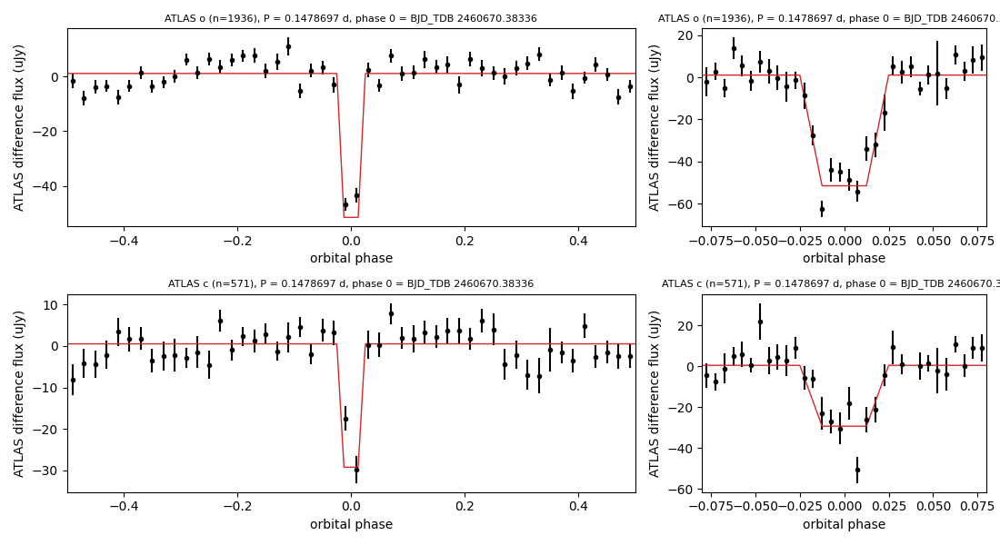

# VSX submission package — 2MASS J03531244-5502363

Status: prepared, not submitted.

## Values to submit

| field | value |
|---|---|
| Position (J2000) | 03 53 12.42 -55 02 36.4 (Gaia DR3, epoch 2000.0) |
| Primary name | 2MASS J03531244-5502363 |
| Other names | Gaia DR3 4731701084150029824; TIC 197904660; WISEA J035312.43-550237.6; DES J035312.44-550238.2; 3eRASS J035311.8-550237; 4XMM J035312.2-550238 |
| Constellation | Reticulum |
| Type | EA/WD (EA if a white-dwarf component is not accepted without a spectrum) |
| Spectral type | not given |
| Magnitude range | 18.29 – 18.67 o (primary eclipse; see remarks for the calibration) |
| Period | 0.1478697 d |
| Epoch | HJD 2460670.3826 (primary minimum; BJD_TDB 2460670.38336) |
| Eclipse duration | 5.0% of the period (10.6 min) |
| Discoverer | (submitter) |
| References | Tonry, J. L.; et al., 2018, ATLAS: A High-cadence All-sky Survey System — 2018PASP..130f4505T; Shingles, L.; et al., 2021, Release of the ATLAS Forced Photometry server for public use — 2021TNSAN...7....1S |
| File | `2MASS_J03531244-5502363_ATLAS_phase.png` ("ATLAS phase plot") |

## Remarks (to submit)

ATLAS forced photometry from 2021 December to 2026 shows a flat-bottomed eclipse lasting 10.6 min (5.0% of the period)
once per 0.1478697 d (3.549 h). The eclipse removes about 30% of the o-band and 57% of the c-band flux. No secondary
eclipse is detected. Half this period (0.0739 d) is rejected: on the full period alternate dips have depths of 48 and
6 uJy in o. Gaia DR3 parallax
9.10 ± 0.11 mas (110 pc); the star lies 2.1 mag below the main sequence for its colour (M_G 13.17, BP−RP 2.82).
X-ray source 3eRASS J035311.8-550237 and 4XMM J035312.2-550238. Magnitudes: out-of-eclipse o ≈ (r+i)/2 from
DES DR2 (r 19.04, i 17.53); SkyMapper DR4 gives 18.44 and ATLAS-REFCAT2 18.23 for the same quantity. Position from
Gaia DR3, moved to epoch J2000.0.

## Measurements

- Joint trapezoid fit to ATLAS o (1936 epochs) and c (571 epochs), BJD_TDB 2459578–2461307, after dropping frames
  with err flags, chi/N >= 10 or error above 3x the band median, and subtracting per-season medians (uJy, never m):
  P = 0.14786971 ± 0.00000004 d (delta chi2 = 1 after scaling chi2_r = 1.52 to 1); primary minimum BJD_TDB
  2460670.38336 (bootstrap over nights ± 0.20 min); first-to-fourth contact 10.6 ± 0.9 min; flat bottom about half
  of that; depth 52.6 ± 3.1 uJy (o) and 29.8 ± 6.0 uJy (c).
- Screen detection at half the period (0.0739348 d; box search delta chi2 435 against a maximum of 76 in 100
  within-season permutations of flux and error pairs, p < 0.01). At the full period the two dips differ:
  48 ± 2 and 6 ± 2 uJy (o), 27 ± 2 and 5 ± 2 uJy (c).
- The dip depth is the same in the first and second halves of the data (o: 26.2 ± 1.7 and 25.9 ± 1.9 uJy at the
  half-period fold).
- The eclipsed light has an o/c flux ratio of 1.77 (1.38–2.34), a blackbody colour temperature of ~4500 K
  (3650–5600 K): hotter than the M-dwarf photosphere, as expected for a cool white dwarf. The fitted ingress/egress
  (~2.6 min each) is poorly constrained by the ATLAS sampling (bootstrap flat-bottom fractions 0.25–0.95).
- Out-of-eclipse levels: o 18.29 / 18.44 / 18.23 and c 19.59 / 19.64 / 19.68 (DES DR2 / SkyMapper DR4 /
  ATLAS-REFCAT2, with o = (r+i)/2 and c = (g+r)/2); eclipse minima follow from the measured depths
  (o 18.67 / 18.89 / 18.59; c 20.50 / 20.61 / 20.70).
- Gaia DR3: G 18.373, BP−RP 2.817, parallax 9.103 ± 0.113 mas, pm (9.46, −124.52) mas/yr, RUWE 1.02,
  ipd_frac_multi_peak 0; no other Gaia source within 12″. Not in the Gaia DR3 variability tables.
- 2MASS J 15.02, Ks 14.04; AllWISE W1 13.89, W2 13.68. Listed as a candidate late-M dwarf (J/ApJ/798/73) and in the
  cool-dwarf catalogue (J/AJ/155/180, Teff 3393 K).
- X-ray: eRASS:3 (4.9″), 4XMM-DR13 (1.5″; XMM ObsID 0651580601, 2011, flux 4.5e-14 erg/s/cm2 in 0.2–12 keV). Automated
  classifications of the XMM source: AGN (Tranin+2022, flagged as an outlier) and QSO (J/MNRAS/503/5263).

## Catalogue checks (2026-09-24)

- VSX live API: nothing within 7.6′ (18 entries within 30′; control: the API returns a listed star at its own position).
- Not in the SSS periodic variables (Drake+2017), ASAS-SN variables, the TESS EB catalogue (Prša+2022) or the Gaia DR3
  eclipsing binaries; each catalogue has entries within 1.5° of this position. The ATLAS variable catalogue
  (Heinze+2018) and the CSS periodic variables do not cover this declination.
- SIMBAD: no entry within 10″. ADS full text: no hits for the Gaia, 3eRASS, 4XMM or short (J0353-5502,
  J035312-550236/-550238) names.

## Data sources

ATLAS (Tonry+2018, 2018PASP..130f4505T; forced photometry server, Shingles+2021, 2021TNSAN...7....1S); Gaia DR3
(2023A&A...674A...1G); DES DR2 (Abbott+2021, 2021ApJS..255...20A); SkyMapper DR4 (Onken+2024, 2024PASA...41...61O);
ATLAS-REFCAT2 (Tonry+2018, 2018ApJ...867..105T); 2MASS (Skrutskie+2006); AllWISE (Cutri+2013); eROSITA eRASS:3;
4XMM-DR13 (Webb+2020, 2020A&A...641A.136W).
Scripts and data: `docs/reports/track1_wd_binaries_2026_09_23/atlas_south/`.
