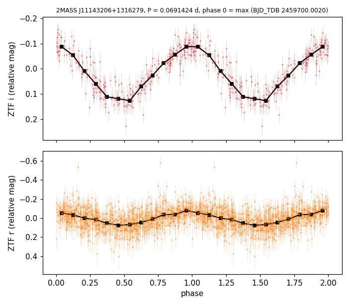

# VSX submission package — 2MASS J11143206+1316279

Status: prepared, not submitted. Filing waits for moderation of the pending submissions (2MASS J22342534+0806596,
TYC 3477-27-1); queue order: ATO J218.9547-17.7889 first.

## Values to submit

| field | value |
|---|---|
| Position (J2000) | 11 14 32.07 +13 16 28.0 (Gaia DR3, epoch 2000.0) |
| Primary name | 2MASS J11143206+1316279 |
| Other names | Gaia DR3 3965186104852552448; SDSS J111432.05+131627.9; WISEA J111432.02+131627.9; TIC 77173350; 3eRASS J111431.9+131627 |
| Constellation | Leo |
| Type | SIN |
| Spectral type | not given |
| Magnitude range | 19.11 – 19.26 r |
| Period | 0.0691424 d |
| Epoch | BJD 2459700.0020 (maximum) |
| Discoverer | A. Keur |
| Reference | Bellm, E. C.; et al., 2019, The Zwicky Transient Facility: System Overview, Performance, and First Results — 2019PASP..131a8002B |
| File | `2MASS_J11143206+1316279_ZTF_phase.png` ("ZTF phase plot") |

## Remarks (to submit)

ZTF light curves from 2018 to 2025 show a sinusoidal modulation with P = 0.0691424 d (1.659 h); an ellipsoidal
orbital period of 0.1382847 d is possible. The amplitude rises from g (0.05 mag) to r (0.15 mag) and i (0.22 mag);
no outbursts. Gaia DR3 places the star at 333 pc; SDSS u-g 0.51 and PS1 g-r 0.48 are much bluer than an M4 dwarf,
suggesting a white dwarf companion. eROSITA X-ray source 3eRASS J111431.9+131627. Accretion and component types
unconfirmed; no spectrum. Position from Gaia DR3, moved to epoch J2000.0.

## Measurements

- Period from a two-harmonic fit to ZTF r and i together: 0.06914237 ± 0.00000004 d (1,040 epochs); a joint fit
  including NEOWISE W1 gives 0.06914240 d. Epoch of maximum (i band): BJD_TDB 2459700.0020 ± 0.0009.
- Two-harmonic peak-to-peak amplitudes (main ZTF field per band): i 0.22 mag (17.68–17.90; ZTF i reads ~0.25 mag
  brighter than PS1/SDSS i for this red star), r 0.15 mag (19.11–19.26), g 0.05 mag (19.82–19.87); NEOWISE W1 0.14 mag.
- Yearly median magnitudes constant to 0.03 mag over 2018–2025.
- Gaia DR3: G 18.61, BP−RP 2.25, parallax 3.00 ± 0.22 mas, RUWE 1.06; no other Gaia source within 12″.
- SDSS u 20.40, g 19.89, r 19.32, i 18.06, z 17.04; PS1 g 19.79, r 19.30, i 18.03, z 17.28, y 16.90; GALEX NUV 21.58.
- Compared with 40,000 nearby M dwarfs of the same PS1 i−z and z−y, g−r is bluer than 99.6% (median 1.27).
- eRASS:3 (0.4″, DetLike 31, 0.2–2.3 keV flux 8.0 × 10⁻¹⁴ erg s⁻¹ cm⁻²); eRASS1 supplementary catalogue (11″, DetLike 5.4).

## Catalogue checks (2026-09-23)

- VSX API: nothing within 30″; 3 entries within 20′ (coverage control).
- Not in SIMBAD, VarWISE, Gaia DR3 variability tables, ATLAS variables, ASAS-SN variables, Li+2025, Rebassa-Mansergas+2025,
  the van Roestel ZTF eclipsing white dwarf catalogue or the eRASS1 CV lists; no ALeRCE object within 3″; no SDSS spectrum.
- ADS full text on all names and on J1114+1316 / J111432+131628: no mention.

## Data sources

ZTF (Bellm+2019, 2019PASP..131a8002B; Masci+2019, 2019PASP..131a8003M); NEOWISE (Mainzer+2014, 2014ApJ...792...30M);
Gaia DR3 (2023A&A...674A...1G); SDSS DR16; Pan-STARRS1 (Chambers+2016); GALEX; eROSITA eRASS1 (Merloni+2024,
2024A&A...682A..34M) and eRASS:3 (Ramos-Ceja+2026).

## Notes (not for submission)

- Type SIN follows the external review (VSX: sinusoidal light curves with a single periodicity, including ellipsoidal
  variables seen at half the orbital period); ELL would commit to P_orb = 0.1382847 d, which is not established.
- Object journal: `docs/object_journals/3965186104852552448.md`. Review text: `~/claude_projects/gaia_local_notes/2026-09-23/astra_j1114/`.
