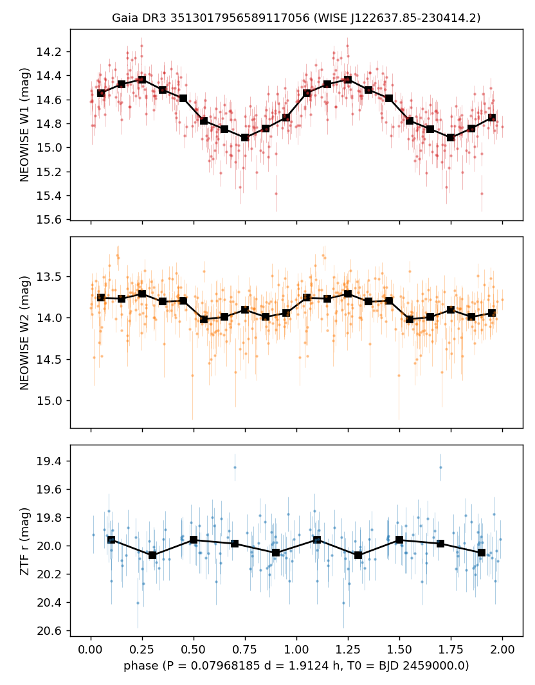

# VSX submission package — WISE J122637.85-230414.2

Status: draft, not submitted. Filing waits for moderation of the pending submissions (2MASS J22342534+0806596,
TYC 3477-27-1). Revised after the second external review (type VAR; remarks shortened).

## Values to submit

| field | value |
|---|---|
| Position (J2000) | 12 26 37.90 -23 04 14.5 (Gaia DR3, epoch 2000.0) |
| Primary name | WISE J122637.85-230414.2 |
| Other names | Gaia DR3 3513017956589117056; 2MASS J12263791-2304144; TIC 22455795; 1eRASS J122637.8-230410; 3eRASS J122637.8-230413; GALEX J122637.8-230415 |
| Constellation | Corvus |
| Type | VAR (see notes) |
| Spectral type | not given |
| Magnitude range | 14.26 – 14.93 W1 (2014–2019 phased light curve; 14.47–14.82 in 2019–2024) |
| Period | 0.07968186 d |
| Epoch | BJD_TDB 2459999.9470 (W1 maximum) |
| Discoverer | Petrosky et al. |
| References | Petrosky, E.; et al., 2021, Variability, periodicity, and contact binaries in WISE — 2021MNRAS.503.3975P; Pelisoli, I.; et al., 2025, A targeted search for binary white dwarf pulsars using Gaia and WISE — 2025MNRAS.540..821P |
| File | `WISE_J122637.85-230414.2_phase.png` ("NEOWISE and ZTF phase plot") |

## Remarks (to submit)

Coherent NEOWISE W1/W2 modulation, 2010-2024; preferred photometric period 0.07968186 d, alternative alias
0.0797167 d. Orbital period unconfirmed; twice the photometric period is possible. W1 amplitude varies with epoch
(0.96 mag in 2010, 0.25-0.34 mag in 2020-2024). Optical modulation weak (ZTF r < 0.14 mag). Gaia DR3 at 253 pc;
g-r about 0.65 mag bluer than M dwarfs of the same i-z. Candidate magnetic white-dwarf binary; cyclotron
interpretation unconfirmed; X-ray association (eROSITA) uncertain. Period previously catalogued by Petrosky et al.
(2021); discussed as unclear by Pelisoli et al. (2025). Position from Gaia DR3, moved to epoch J2000.0.

## Measurements

- NEOWISE-R + 2010 cryogenic WISE single exposures: 227 W1 / 223 W2 clean points; Lomb–Scargle power 0.62 (W1).
- W1 binned range 14.45–14.91 (2014–2024); 14.26–14.93 in 2014–2019; 14.47–14.82 in 2019–2024.
- Sinusoid full amplitudes: W1 0.46 ± 0.03, W2 0.29 ± 0.04 mag (2014–2024).
- ZTF forced photometry (142 r images): full amplitude 0.06, 95% upper limit 0.14 mag at P.
- Gaia DR3: G 19.54, BP−RP 2.27, parallax 3.96 ± 0.38 mas, RUWE 0.98, no other Gaia source within 15″.
- PS1: g 20.78, r 20.15, i 18.99, z 18.14, y 17.84; GALEX NUV 22.97 ± 0.40.
- eRASS1 (4.4″) and eRASS:3 (1.1″), 0.2–2.3 keV flux 2.5–4.3 × 10⁻¹⁴ erg s⁻¹ cm⁻².

## Notes (not for submission)

- Type: VAR (recommended by the second external review; AM: would be more specific than the evidence). Label used in the journal: infrared
  periodic variable and candidate magnetic white-dwarf binary; orbital period and evolutionary state unconfirmed.
- VSX API: nothing within 30″, 7 entries within 20′ (coverage control), checked 2026-09-23.
- Object journal: `docs/object_journals/3513017956589117056.md`.
