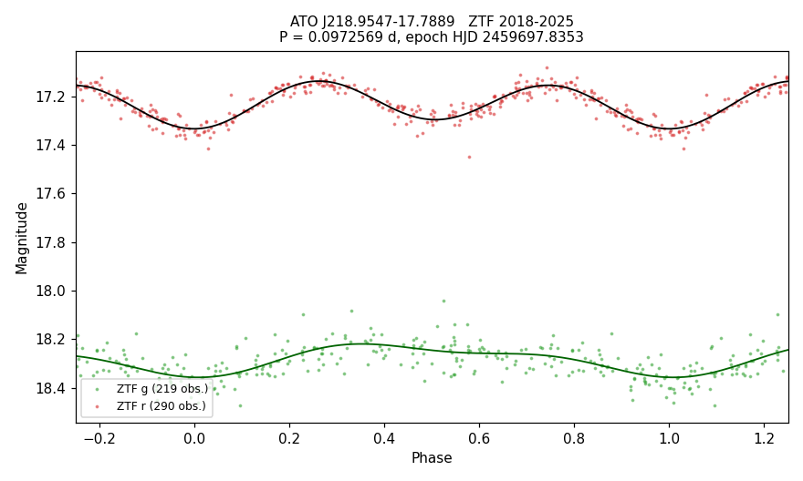

# VSX submission package — ATO J218.9547-17.7889

Status: prepared, not submitted. Revised 2026-09-23: Koen & Kniazev 2024 added.

## Values to submit

| field | value |
|---|---|
| Position (J2000) | 14 35 49.15 -17 47 19.7 (Gaia DR3, epoch 2000.0) |
| Primary name | ATO J218.9547-17.7889 |
| Other names | Gaia DR3 6285270400986331136; 2MASS J14354915-1747195; TIC 157938668; WISEA J143549.14-174720.0; PM I14358-1747; 3eRASS J143549.0-174716; 1eRASS J143549.2-174715 |
| Constellation | Libra |
| Type | ELL: |
| Spectral type | not given |
| Magnitude range | 17.14 – 17.33 r |
| Period | 0.0972569 d |
| Epoch | HJD 2459697.8353 (deeper minimum in r) |
| Discoverer | ATLAS |
| References | Heinze, A. N.; et al., 2018, A First Catalog of Variable Stars Measured by ATLAS — 2018AJ....156..241H; Koen, C., 2022, Candidate and confirmed ultrashort period main-sequence binary stars — 2022MNRAS.516.2540K; Koen, C.; Kniazev, A. Y., 2024, WISE J152614.95-111326.4, an unusual variable star — 2024PASA...41..108K |
| File | `ATO_J218.9547-17.7889_ZTF_phase.png` ("ZTF phase plot") |

## Remarks (to submit)

ZTF light curves from 2018 to 2025 give a period of 0.0972569 d (2.334 h). In r the light curve has two humps per
cycle with unequal minima; in g a single hump dominates. The ATLAS variable-star catalogue lists half this period.
The star was studied as ATL 1435-1747 with the same period. It is an X-ray source in eROSITA and Swift. Gaia DR3
places it at 83 pc and 1.7 mag below the main sequence for its colour. Koen & Kniazev (2024) discuss it as
ATO J218.9548-17.7890 and consider a white dwarf + red dwarf pre-CV likely. Position from Gaia DR3, moved to
epoch J2000.0.

## Measurements

- Period from a two-harmonic fit to ZTF g and r together: 0.09725693 ± 0.00000003 d (Koen 2022: 0.09725686 ± 0.00000005 d).
- ZTF r: maximum 17.14, deeper minimum 17.33, other minimum 17.30 (amplitude 0.20 mag). ZTF g: 18.22 – 18.36
  (amplitude 0.14 mag), one maximum per cycle.
- Period tests (external review, 2026-09-23): the r-band frequency beats its daily aliases in all eight calendar
  years; a fit to the first half of the data predicts the second half with chi2 431 against 1122–1142 for the
  alias periods; the 2.334 h fundamental improves the fit by chi2 426.
- Data: 219 g and 290 r clean ZTF epochs, HJD 2458199 – 2460909.
- Gaia DR3: G 16.683, BP−RP 2.595, parallax 12.058 ± 0.112 mas (82.9 pc), M_G 12.09, RUWE 1.18.
- Colours: Pan-STARRS g−r 0.89, r−i 1.35; SkyMapper g−r 0.72, r−i 1.56.
- X-ray: eRASS1 (4.8″), eRASS:3 (3.2″), Swift LSXPS J143549 (1.1″, pointings 2024-02-28 to 2025-09-18).

## Catalogue checks (2026-09-23)

- VSX live API: nothing within 1′ (11 entries within 20′).
- ATLAS variables (Heinze+2018): ATO J218.9547-17.7889, class MSINE, period 0.048689 d (half the period above).
- Koen 2022 (J/MNRAS/516/2540): table 5, ATL 1435-1747, P = 0.09725686 d; table 6, Teff 3360 K (M3) and
  Mbol 10.83 (M5), with an M5.5 type listed for the case of two stars of similar brightness.
- Koen & Kniazev 2024 (2024PASA...41..108K), section 9: discussed as ATO J218.9548-17.7890; SED fit with a white
  dwarf component constrained by the GALEX NUV point; a low-accretion-rate pre-CV considered likely.
- Not in Ritter–Kolb, Downes, Liu+2025 (arXiv:2505.10478), the eRASS1 CV catalogue, Schwope+2026, SDSS DR20 eROSITA CVs,
  Pala+2020, Li+2025 or Gentile Fusillo+2021. SIMBAD: listed only under its ATLAS name.
- ADS full text: only Koen 2022 (as ATL 1435-1747); ADS does not index the body of Koen & Kniazev 2024.

## Data sources

ZTF (Bellm+2019, 2019PASP..131a8002B; Masci+2019, 2019PASP..131a8003M); ATLAS (Tonry+2018, 2018PASP..130f4505T;
Heinze+2018, 2018AJ....156..241H); Gaia DR3 (2023A&A...674A...1G); eROSITA eRASS1 (Merloni+2024, 2024A&A...682A..34M)
and eRASS:3 (Ramos-Ceja+2026); Swift LSXPS (Evans+2023, 2023MNRAS.518..174E); Koen 2022 (2022MNRAS.516.2540K); Koen & Kniazev 2024
(2024PASA...41..108K).
