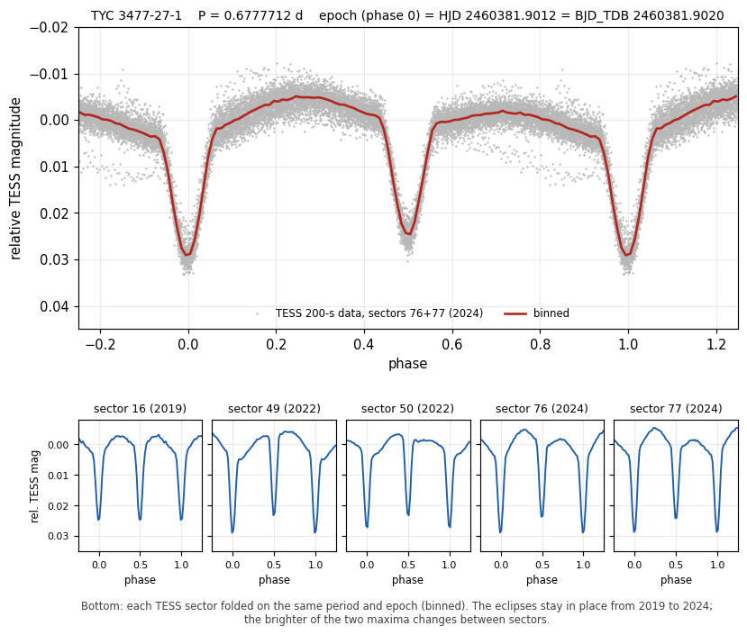
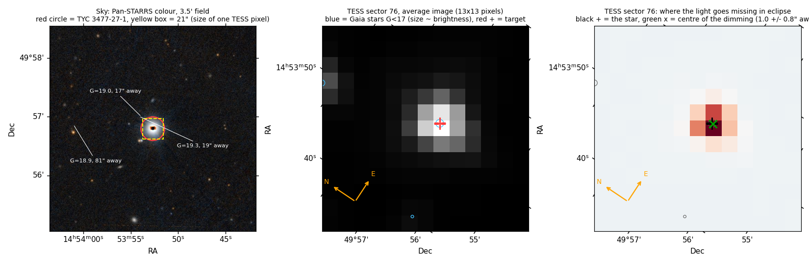
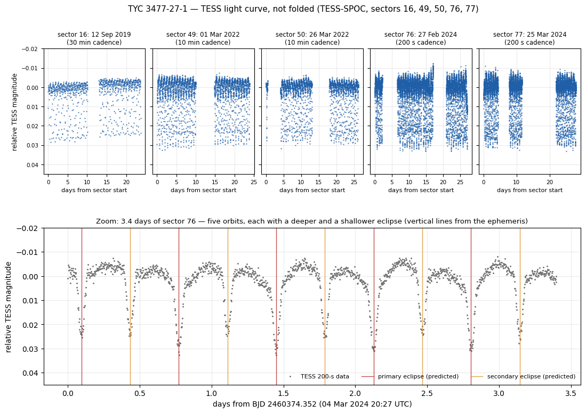

# VSX submission package — TYC 3477-27-1

Submitted 2026-09-22 15:22 UTC through the VSX New Star Wizard. Provisional designation TYC 3477-27-1;
status New (pending moderation).

## Submitted values

| field | value |
|---|---|
| Position (J2000) | 14 53 52.69 +49 56 47.7 (Gaia DR3, epoch 2000.0) |
| Primary name | TYC 3477-27-1 |
| Other names | TIC 161042835; 2MASS J14535269+4956476; Gaia DR3 1593152388271709824; UCAC4 700-056053 |
| Type | EA |
| Spectral type | not given |
| Magnitude range | 11.46 V (mean V, Gaia DR3 synthetic photometry); amplitude 0.034 TESS |
| Period | 0.6777712 d |
| Epoch | HJD 2460381.9012 (BJD_TDB 2460381.90202) |
| Eclipse duration | 13% (2.13 h) |
| Discoverer | A. Keur |
| Reference | Ricker, G. R.; et al., 2014, Transiting Exoplanet Survey Satellite (TESS) — 2014SPIE.9143E..20R |
| Files | `tyc3477_tess_phase_v2.png` ("TESS phase plot"); `tyc3477_imagery.png` ("Field and TESS pixel check") |

## Remarks (as submitted)

TESS light curves from sectors 16, 49, 50, 76 and 77 (2019 to 2024) show shallow primary and secondary
eclipses, with the secondary at phase 0.50. The two maxima are unequal, and which one is brighter changes
from sector to sector. Period and epoch are from eclipse times spread over 2019 to 2024. Gaia DR3 gives a
597-day astrometric orbit for this star, so the eclipsing pair may be part of a triple system. Two earlier
TESS survey tables list the star without classifying it as variable. Mean V magnitude from Gaia DR3
synthetic photometry; position from Gaia DR3, moved to epoch J2000.0.

## Measurements

- Eclipse depths (TESS): primary 0.029 mag, secondary 0.026 mag at phase 0.50.
- Amplitude per sector: 0.029 / 0.034 / 0.031 / 0.034 / 0.035 mag (S16 / 49 / 50 / 76 / 77; S16 at 30-min cadence).
- Maxima difference, flux at phase 0.25 minus 0.75: +795 ± 141, −3,081 ± 119, −210 ± 164, +2,937 ± 543,
  +3,314 ± 289 ppm (S16 / 49 / 50 / 76 / 77).
- Dimming centroid offset from the star: 1.0 ± 0.8″ (S76), 0.9 ± 1.1″ (S77).
- Mean V: 11.456 (Gaia DR3 GSPC); 11.447 (G, BP−RP relation); 11.46 (Tycho-2).
- Period from eclipse times in five sectors (2019–2024): 0.6777712 ± 0.0000006 d.

## Catalogue checks (2026-09-22)

- VSX (native API, 0.1°): not listed; nearest entry Gaia DR3 1593155141347417216 (ROT) at 3.7′.
- Names within 3″: Tycho-2 3477-27-1, UCAC4 700-056053, 2MASS 14535269+4956476, TIC 161042835 (Tmag 10.875),
  Gaia DR3 1593152388271709824.
- Green+2023 (J/MNRAS/522/29): table 2 (all TESS targets; score 0.83, Porb 0.67759 d); not in table 3
  (selected ellipsoidal candidates).
- Kostov+2025 (J/ApJS/279/50): table 2 (unvetted targets, no period); not in tables 3–4.
- Gaia DR3 variability tables and Kounkel+2021: not listed. ADS full text: 0 hits on seven designations.

## Data sources

TESS (Ricker+2014, 2014SPIE.9143E..20R); TESS-SPOC light curves (Caldwell+2020, 2020RNAAS...4..201C);
Gaia DR3 (2022yCat.1355....0G); Gaia DR3 synthetic photometry (2023A&A...674A..33G);
Green+2023 (2023MNRAS.522...29G); Kostov+2025 (2025ApJS..279...50K).
