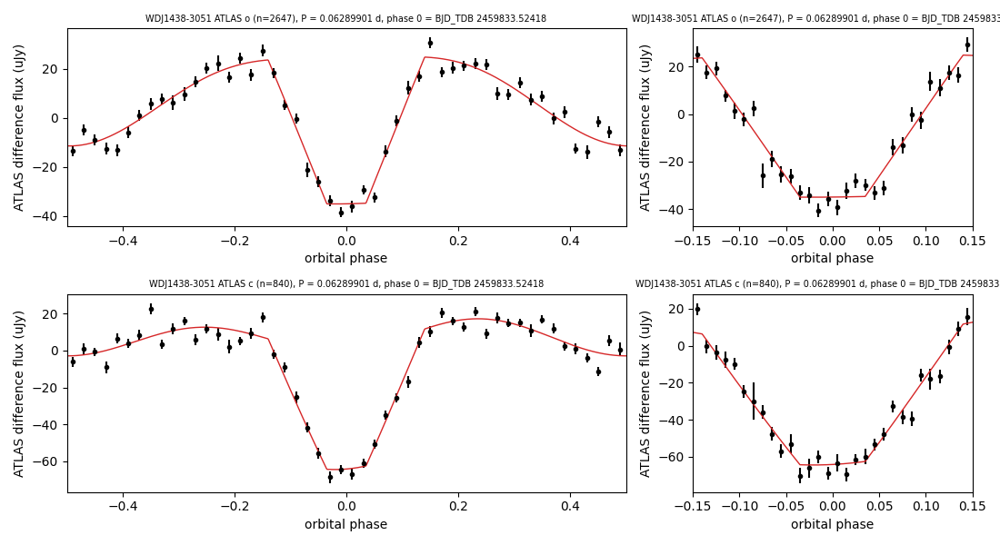

# VSX revision request — USNO-A2.0 0525-17852977 (VSX OID 623396) = WDJ143844.65-305148.24

Status: prepared, not submitted. Filed as a revision request on the star's VSX page (logged in).

## Current VSX record (API, 2026-09-29)

| field | current | proposed |
|---|---|---|
| Name | USNO-A2.0 0525-17852977 | unchanged |
| Type | UG: | **UG+E** |
| Range | 16.9 – 18.5 CV | unchanged (ATLAS outburst maxima o 17.08, c 17.14 agree with the listed maximum) |
| Period | none | **0.06289901 d** (90.5746 min) |
| Epoch | none | **HJD 2459833.5234** (mid-eclipse; BJD_TDB 2459833.52418) |
| Eclipse duration | none | **22% of the period** (see remarks) |
| Discoverer | Taichi Kato | unchanged |
| Other names to add | — | Gaia DR3 6217118886429978112; WDJ143844.65-305148.24; 2MASS J14384464-3051480; TIC 379593642; 3eRASS J143844.5-305149 |
| References to add | — | Tonry, J. L.; et al., 2018, ATLAS: A High-cadence All-sky Survey System — 2018PASP..130f4505T; Shingles, L.; et al., 2021, Release of the ATLAS Forced Photometry server for public use — 2021TNSAN...7....1S |
| File | — | `WDJ1438-3051_fold.png` ("ATLAS phase plot") |

## Remarks (to submit)

Eclipsing dwarf nova. ATLAS forced photometry (2016-2026, quiescent data) shows eclipses once per 0.06289901 d
(90.5746 min): a V-shaped eclipse that removes 25% of the quiescent flux in o and 41% in c, and a double-humped
modulation between eclipses. First-to-last contact is 16-28% of the period depending on band and method; 22% is the
o-band width where the flux is more than 3 sigma below the out-of-eclipse level. TESS sector 102 (120 s) shows the
same double-humped modulation (highest peak at twice the orbital frequency). ATLAS records 8 outbursts to o 17.1 and
c 17.1 between 2024 January and 2025 September (episodes separated by more than 15 days); the 2017-2023 seasons (45-118 nights per year) show none above 5 sigma.
Gaia DR3 parallax 4.33 ± 0.19 mas; X-ray source 3eRASS J143844.5-305149.

## Measurements (`eclipse_fit.py`, `duration_check.py`, `magnitudes.py`)

- ATLAS o (2647 quiescent points) and c (840), BJD_TDB 2457417-2461303, after dropping frames with err flags,
  chi/N >= 10 or error above 3x the band median, removing outburst nights (330 points, nightly median > 5 robust
  sigma above quiescence, plus 5 days), subtracting per-season medians and clipping bright outliers (uJy, never m).
- Joint fit, both bands: offset + first and second orbital harmonics + trapezoid eclipse.
  grid period 0.062898995 d. Refitted at the refined period (`shape_at_refined.py`, 100-resample bootstrap over nights):
  mid-eclipse ± 0.18 min; depth 58.9 ± 4.0 uJy (o), 63.8 ± 6.4 uJy (c); trapezoid first-to-last contact 25.4 ± 0.8 min
  (28% of P), flat fraction 0.25.
- Fine period pass (`period_refine.py`, eclipse shape fixed, 81 periods, centre free): P = 0.062899012 ±
  0.000000006 d (delta chi2 = 1 after scaling chi2_r to 1); mid-eclipse BJD_TDB 2459833.52418.
- Model-light duration (bins of 0.01 in phase more than 3 sigma below the out-of-eclipse model): o -0.12 to +0.10
  (22%, 19.9 min), c -0.07 to +0.09 (16%, 14.5 min); half-depth widths 16% (o) and 13% (c).
- Quiescent levels from ATLAS-REFCAT2 (o = (r+i)/2 = 18.04, c = (g+r)/2 = 18.37); eclipse minima o 18.30, c 18.99.
- Outbursts (frames with errors above 3x the median dropped; nights with median point S/N > 5 and > 5 robust sigma
  above quiescence): o 47 nights in 5 episodes, c 12 nights in 6 episodes, starting MJD 60324-60935; brightest
  nightly medians o 17.08, c 17.14.
- Gaia DR3: G 18.287, BP-RP 0.277, parallax 4.328 ± 0.192 mas, RUWE 1.06.

## Catalogue checks (2026-09-29)

- VSX API: this entry (UG:, no period) is the only one within 36 arcsec; control star AM Her returned.
- No period in Ritter & Kolb, Inight et al., the TESS CV period catalogue, Oliveira da Rosa et al. (2024) or
  Canbay et al. (2023, AJ 165, 163: Porb none); SIMBAD 3 references; ADS full text: no hits by Gaia id, WDJ or J-name
  (journal docs/object_journals/6217118886429978112.md).

## Data sources

ATLAS (Tonry+2018; forced photometry server, Shingles+2021); ATLAS-REFCAT2 (Tonry+2018, 2018ApJ...867..105T);
Gaia DR3 (2023A&A...674A...1G); TESS (Ricker+2015); 2MASS (Skrutskie+2006); eROSITA eRASS:3.
Data: `atlas_raw/6217118886429978112.txt`; results: `eclipse_fit.json`, `duration_check.json`, `magnitudes.json`.
