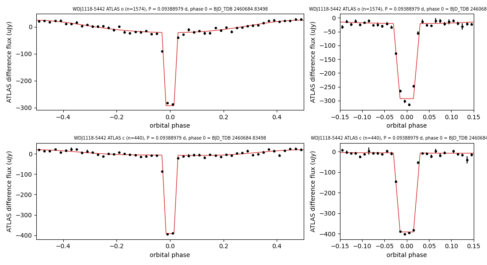

# VSX submission package — 2MASS J11180308-5442175 = WDJ111803.09-544218.04

Status: prepared, not submitted (new entry).

## Values to submit

| field | value |
|---|---|
| Position (J2000) | 11 18 03.09 -54 42 18.04 (Gaia DR3, epoch 2000.0) |
| Primary name | 2MASS J11180308-5442175 |
| Other names | Gaia DR3 5346312514819760896; WDJ111803.09-544218.04; TIC 450781262; WISEA J111803.15-544217.6 |
| Constellation | Centaurus |
| Type | EA+R (EA/WD+R if a white-dwarf component is accepted without a spectrum) |
| Spectral type | not given |
| Magnitude range | 17.60 – 20.26 o (primary eclipse; see remarks for the calibration) |
| Period | 0.09388979 d |
| Epoch | HJD 2460684.8343 (primary minimum; BJD_TDB 2460684.83517; corrected 2026-10-07 for the ATLAS mid-exposure offset of +15 s) |
| Eclipse duration | 5.6% of the period (7.6 min) |
| Discoverer | (submitter) |
| References | Tonry, J. L.; et al., 2018, ATLAS: A High-cadence All-sky Survey System — 2018PASP..130f4505T; Shingles, L.; et al., 2021, Release of the ATLAS Forced Photometry server for public use — 2021TNSAN...7....1S |
| File | `WDJ1118-5442_fold.png` ("ATLAS phase plot") |

## Remarks (to submit)

ATLAS forced photometry (2022-2026) shows a flat-bottomed total eclipse lasting 7.6 min (5.6% of the period) once per
0.09388979 d (2.2534 h), with a reflection hump peaking at phase 0.5. The eclipse removes 91% of the o-band flux and
all of the c-band flux (102 ± 2%): the hot component is fully hidden. TESS 120-s data (two sectors) show the same
period in a crowded aperture. Gaia DR3 parallax 3.37 ± 0.08 mas (297 pc), G 17.38, BP-RP 0.08, M_G 10.0: below the
main sequence, as for a white dwarf; 2MASS Ks 16.08 and WISE W1 15.52 indicate a cool companion (M_Ks ~8.7).
Magnitudes: out-of-eclipse o ≈ (r+i)/2 and c ≈ (g+r)/2 from ATLAS-REFCAT2 (o 17.60, c 17.43); c minimum fainter
than 21.05. Position from Gaia DR3, moved to epoch J2000.0.

## Measurements (`eclipse_fit.py`, `duration_check.py`, `magnitudes.py`)

- ATLAS o (1574 points) and c (440), BJD_TDB 2459586-2461254, after dropping frames with err flags, chi/N >= 10 or
  error above 3x the band median, subtracting per-season medians and clipping bright outliers only (uJy, never m).
- The eclipse centre was located by a coarse box search over the full phase (significance 265), then a joint fit:
  offset + first and second orbital harmonics + trapezoid eclipse (grid period 0.093889868 d).
  Refitted at the refined period (`shape_at_refined.py`, 100-resample bootstrap over nights): mid-eclipse ± 0.06 min;
  first-to-last contact 7.6 ± 0.2 min (5.6% of P), flat fraction 0.5; depth 280.1 ± 5.1 uJy (o), 384.9 ± 6.9 uJy (c).
- Fine period pass (`period_refine.py`, eclipse shape fixed, 81 periods, centre free): P = 0.093889794 ±
  0.000000002 d (delta chi2 = 1 after scaling chi2_r to 1); mid-eclipse BJD_TDB 2460684.83517 (ATLAS MJD is the exposure start; +15 s applied 2026-10-07). The grid period of
  eclipse_fit.py is 0.000000074 d longer; its grid step (8e-7 d) is too coarse for a 6%-wide eclipse over 4.6 years.
- Model-light duration (0.01-phase bins more than 3 sigma below the out-of-eclipse model): o -0.03 to +0.03 (6%, 8.1 min),
  c -0.02 to +0.03 (5%, 6.8 min); half-depth width 4% in both bands.
- Reflection: first-harmonic amplitudes 24 uJy (o) and 15 uJy (c), maximum at phase 0.5.
- Out-of-eclipse levels (ATLAS-REFCAT2) o 17.60, c 17.43; at phase 0 (reflection minimum) 309 and 377 uJy;
  eclipse minima o 20.26 (residual 29 ± 5 uJy, so ± 0.2 mag), c fainter than 21.05 (residual -8 uJy).
- Gaia DR3: G 17.377, BP-RP 0.082, parallax 3.370 ± 0.080 mas, RUWE 1.14. 2MASS J 16.69, Ks 16.08; AllWISE W1 15.52,
  W2 15.95. MWDD: DA, 14.9 kK, log g 7.05 (photometric).

## Catalogue checks (2026-09-29)

- VSX API: nothing within 36 arcsec (686 entries within 30 arcmin; control star AM Her returned at its position).
- SIMBAD: WD* with its Gaia identifiers only (3 references); MWDD no period; no period in any VizieR table (all-table
  cone 3 arcsec), Oliveira da Rosa et al. (2024), Filiz et al. (2026), Reindl et al. (2021) or the TESS CV catalogue;
  ADS full text: no hits by Gaia id or WDJ name (journal docs/object_journals/5346312514819760896.md).

## Data sources

ATLAS (Tonry+2018; forced photometry server, Shingles+2021); ATLAS-REFCAT2 (Tonry+2018, 2018ApJ...867..105T);
Gaia DR3 (2023A&A...674A...1G); TESS (Ricker+2015); 2MASS (Skrutskie+2006); AllWISE (Cutri+2013); MWDD.
Data: `atlas_raw/5346312514819760896.txt`; results: `eclipse_fit.json`, `duration_check.json`, `magnitudes.json`.
